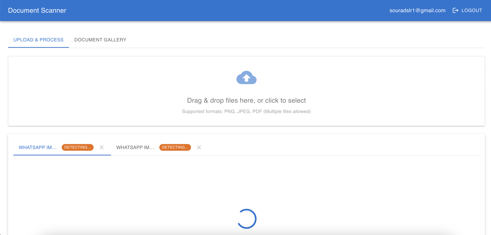
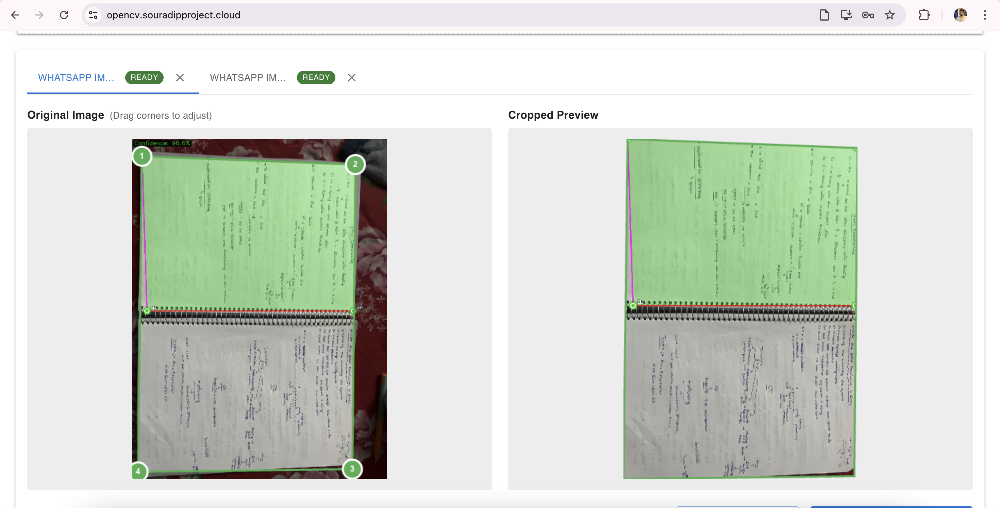
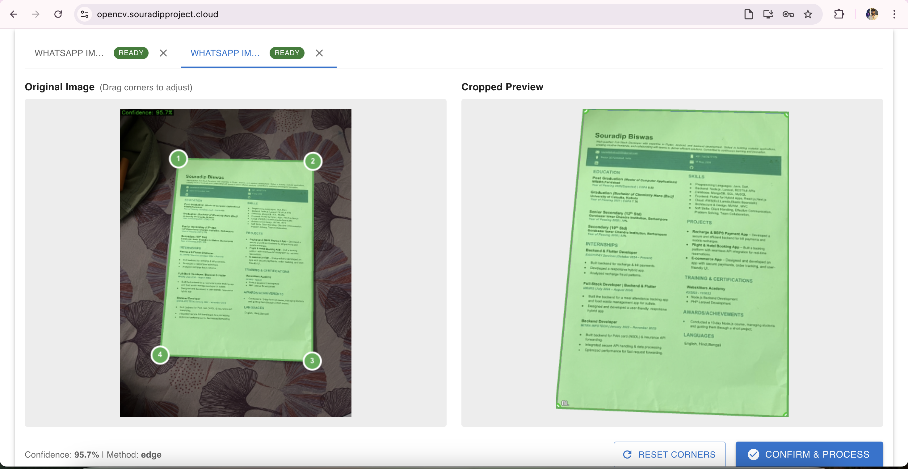
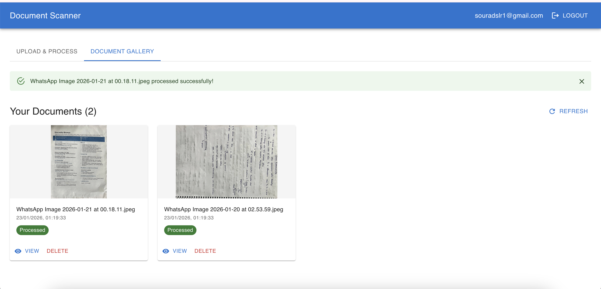
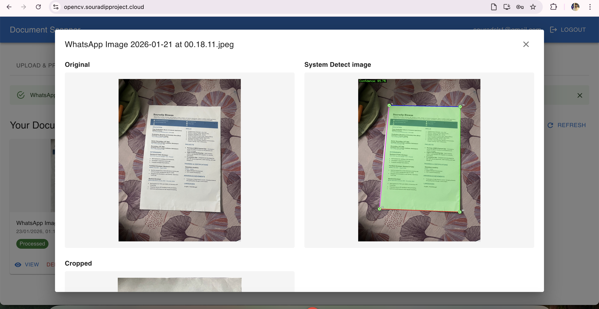
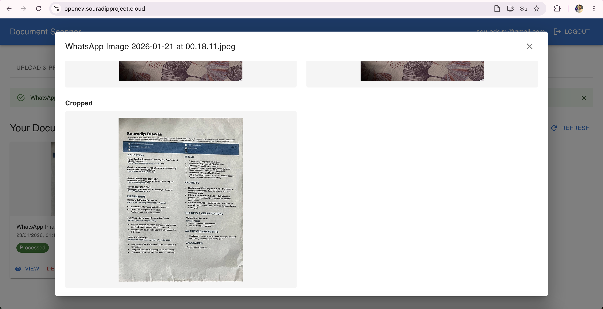

## Document Scanner & Image Extraction (Easy Guide)

By Souradip Biswas

### How does it work? (Step by Step)

1. **Login/Register**: Sign in with your account.
2. **Upload**: Choose one or more images to upload.
3. **Detection**: The system finds the document in each image and draws a box around it.
4. **Preview & Adjust**: You see a preview. You can drag the corners to fix the box if needed.
5. **Process**: Click 'Confirm & Process' to crop and enhance the document.
6. **Gallery**: All your processed documents are saved and shown in your gallery. You can view, download, or delete them.

### Screenshots

---

### How to run the project

1. Install dependencies:
	- `npm install`
2. Start the development server:
	- `npm run start`
3. Open your browser and go to `http://localhost:3000`

## env varriable 
REACT_APP_PROD_URL=

REACT_APP_FIREBASE_API_KEY=
REACT_APP_FIREBASE_AUTH_DOMAIN=
REACT_APP_FIREBASE_PROJECT_ID=
REACT_APP_FIREBASE_STORAGE_BUCKET=
REACT_APP_FIREBASE_MESSAGING_SENDER_ID=
REACT_APP_FIREBASE_APP_ID=
GENERATE_SOURCEMAP=
